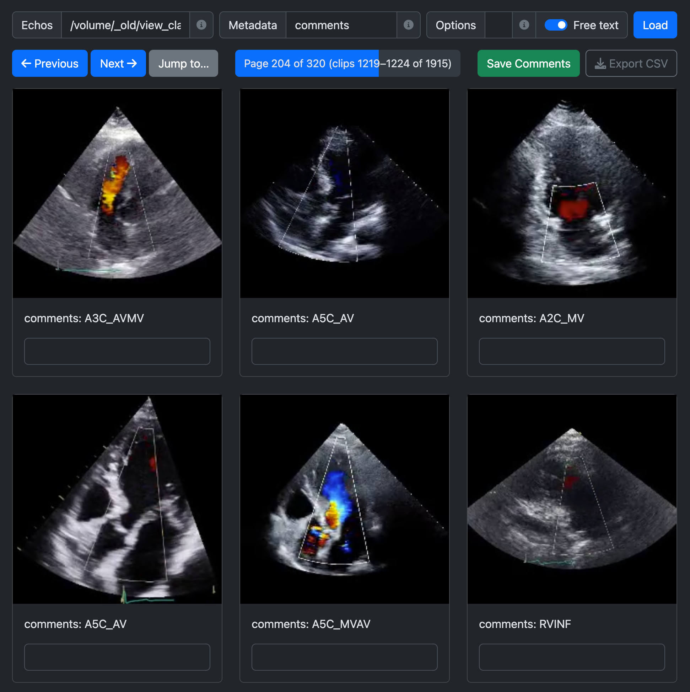

# clipviewer

**clipviewer** is a simple web app for viewing and annotating video clips; it was designed with viewing and annotating echo clips in mind

## Features

- Browse through a collection of video clips
- View metadata for each clip
- Add and save comments for individual clips
- Export comments as a CSV file
- Navigate using previous/next buttons (including left and right keys on your keyboard) or jump to a specific page
- Progress bar to show current position in the clip collection
- Reviewed clips are highlighted

## Setup

1. Clone the repository:
   ```
   git clone <repository-url>
   cd clipviewer
   ```

2. Install dependencies:
   ```
   uv sync
   ```

## Usage

1. Start the Flask server:
   ```
   uv run python app.py [OPTIONS]
   ```

2. Open a web browser and navigate to `http://localhost:8888` (or the appropriate port if you've changed it).

## CLI Options

| Option | Description | Default |
|---|---|---|
| `--port` | Port number to run the server on | `8888` |
| `--csv-dir` | Allowed directory for CSV files | Current working directory |
| `--debug / --no-debug` | Enable Flask debug mode | `--no-debug` |

## Notes

- Videos are automatically converted to H.264 MP4 for cross-browser compatibility. This requires `ffmpeg` to be installed.
- Annotations are stored in a SQLite database alongside the input CSV file (e.g., `echoes_clipviewer.db`). Use the "Export CSV" button to download comments as a CSV file.
- Comments are preserved when reloading the same CSV — only video paths and metadata are updated.
