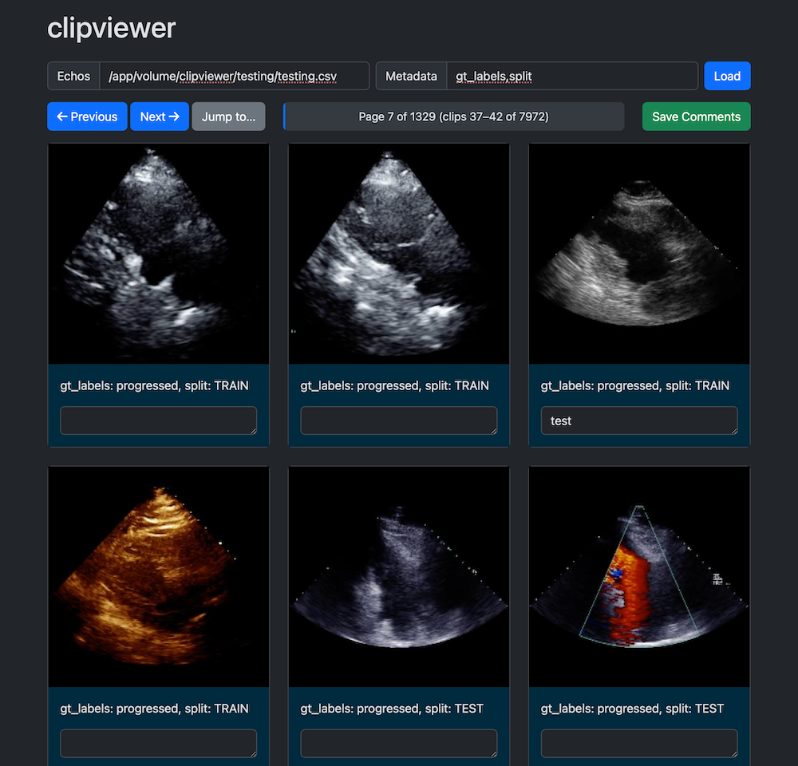

# clipviewer

**clipviewer** is a simple web app for viewing and annotating video clips; it was designed with viewing and annotating echo clips in mind

## Features

- Browse through a collection of video clips
- View metadata for each clip
- Add and save comments for individual clips
- Navigate using previous/next buttons (including left and right keys on your keyboard) or jump to a specific page
- Progress bar to show current position in the clip collection
- Reviewed clips are highlighted

## Setup

1. Clone the repository:
   ```
   git clone <repository-url>
   cd clipviewer
   ```

2. Install the required Python packages:
   ```
   pip install flask pandas
   ```

3. (Optional:) Adjust `VIDEO_BASE_PATH`, `CLIPS_PER_PAGE` in `app.py`

## Usage

1. Start the Flask server:
   ```
   python app.py [-h] port(optional)
   ```

2. Open a web browser and navigate to `http://localhost:8888` (or the appropriate port if you've changed it).

## Notes

- Comments are saved to the same directory as the echo csv file, with `_comments.csv` appended to it. Ensure that this app has permissions to write to the same directory that the echo csv file is in.
